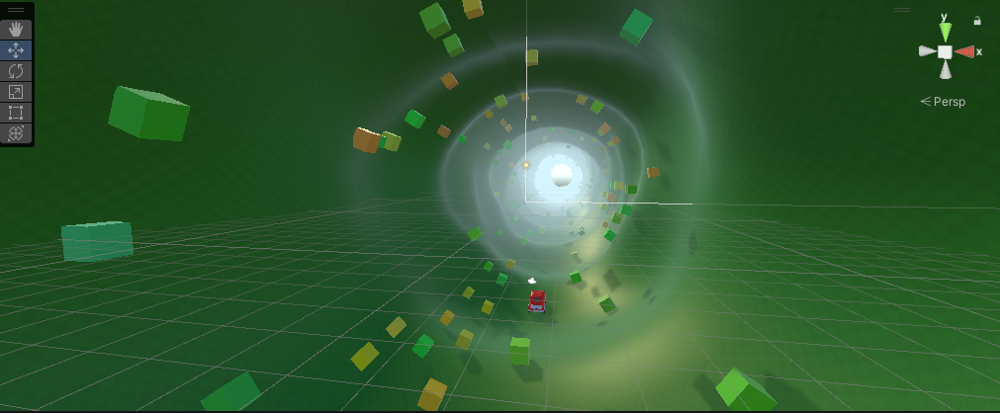

🚗 'Cylinder Racer' – 无尽圆柱赛道
- 项目描述： **Unity + DeepSeek API + unityMCP** 全 AI 辅助生成的无尽驾驶游戏。  
> 实现从代码生成到玩法调试的完整自动化流程。

🎮 游戏简介
- 在一条无限延伸的圆柱形隧道中驾驶赛车，通过键盘方向键控制车辆左右转向，收集得分方块。
- 核心玩法：向左/向右切换车道，尽量久地存活并获取高分
- **操作方式**：
  - `A/D` `←/→` 控制转向
- **得分方式**：
  - 靠近立方体（`ScoreCube`）自动拾取 +1 分

## 🧱 技术特色

| 模块 | 说明 |
|------|------|
| **程序化世界** | `WorldGenerator` 使用柏林噪声生成圆柱形赛道，地形随机起伏，世界片段无限循环 |
| **物理驱动车辆** | `Car` 基于 `WheelCollider` 转向回正 |
| **动态摄像机** | `CameraFollow` 平滑跟随，缓动延迟可配置，启动时提供剧院式过渡 |
| **随机物品生成** | ScoreCube 在世界生成时根据概率自动生成，颜色/大小/旋转均有随机性 |
| **分数系统** | `GameManager` 单例管理分数与游戏结束状态，`ScoreUI` 实时刷新 UI |
| **性能优化** | 视野裁剪：远距离物品关闭渲染与阴影，减少 DrawCall |

## 🤖 AI 辅助开发

本项目的 **全部 C# 脚本均由 DeepSeek API 驱动生成**。工作流如下：

```
VS Code + Unity MCP ↔️ DeepSeek API
         ↓
  AI 理解需求 → 生成代码 → 实时导入 Unity 运行
         ↓
  人工反馈/调整 → AI 迭代修正 → 最终成型
```

- 使用 `Unity MCP` 作为中间件，让 AI 能直接读写 Unity 场景与脚本
- 通过自然语言描述功能需求（如“添加车轮滚动效果”、“生成随机颜色的方块”），AI 即时产出可用代码

## 📂 项目结构

```
Assets/
├── Scripts/
│   ├── Car.cs                  # 车辆控制、物理、特效、得分检测
│   ├── BasicMovement.cs        # 物体向玩家移动并跟随车辆旋转
│   ├── CameraFollow.cs         # 第三人称相机跟随
│   ├── WorldGenerator.cs       # 程序化世界生成 (赛道、障碍物、Gate、ScoreCube)
│   ├── GameManager.cs          # 分数管理 & 游戏结束逻辑
│   ├── Gate.cs                 # 通过门加分 (触发器)
│   ├── Obstacle.cs             # 障碍物碰撞即游戏结束
│   ├── ScoreCube.cs            # 无碰撞体，由 Car 距离检测拾取
│   └── ScoreUI.cs              # UI 分数显示
├── Prefabs/                    # 车辆、障碍物、Gate、ScoreCube 等预制体
├── Materials/                  # 赛道材质等
└── Scenes/
    └── Game.unity         # 主游戏场景
```
## 📸 截图



## 🎯 未来计划

- 多赛道皮肤与车辆皮肤切换
- 完善障碍物和得分物体或者任意门的效果，还有结束事件与效果
- 更多随机事件（加速板、护盾等）
